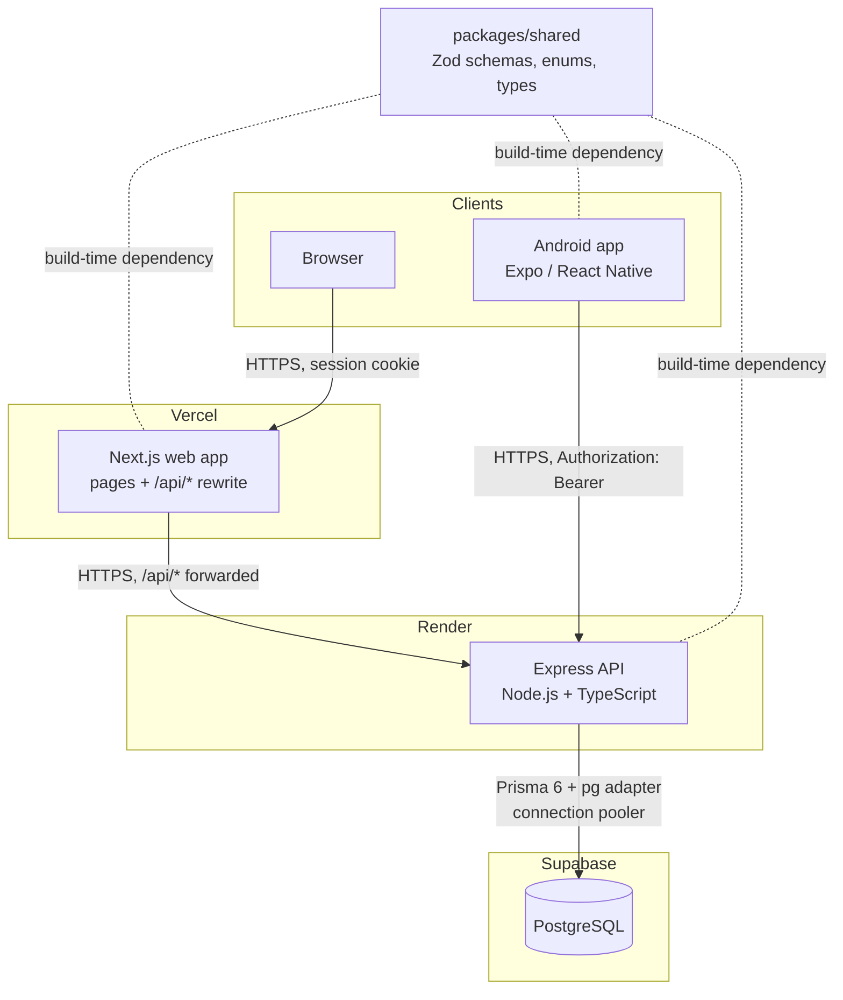
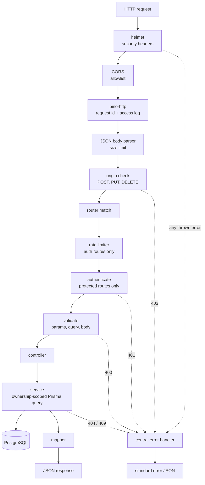
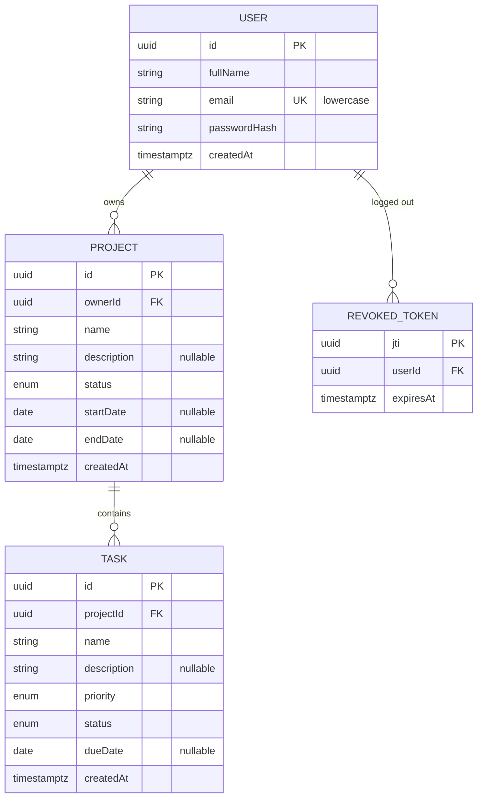
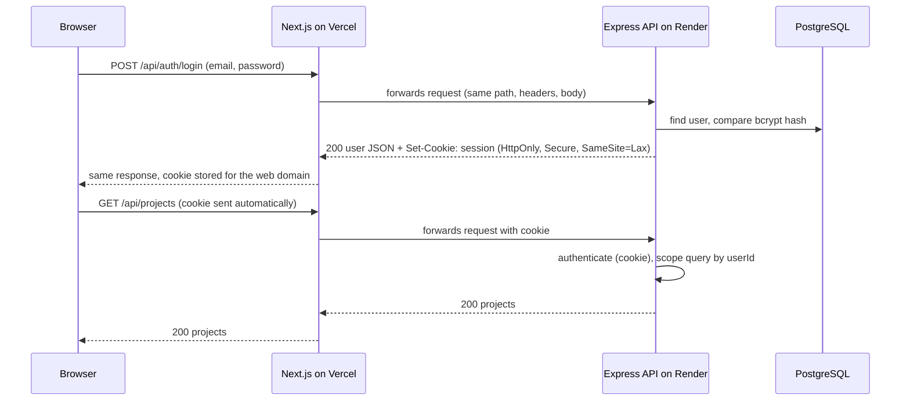
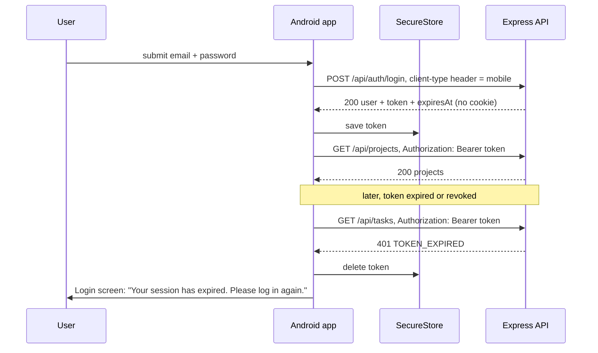
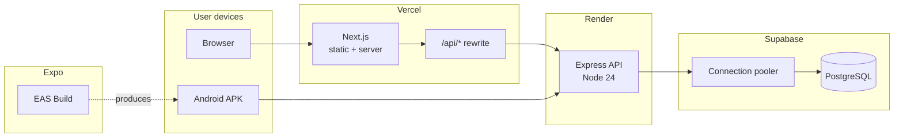

# System Architecture

This document describes how the system is structured and how its parts interact. It is derived from [requirements.md](requirements.md) and [scope-and-decisions.md](scope-and-decisions.md). Decisions with significant tradeoffs are recorded as ADRs in [decisions/](decisions/).

Exact request/response contracts are defined in Phase 4 and the database schema in Phase 3. This document fixes the structure those phases build on.

## 1. Overview

The system has one backend, one database and two clients:

- **API** (`apps/api`): Express REST API on Render. The only component that talks to the database.
- **Database**: PostgreSQL on Supabase, accessed through Prisma 6.
- **Web** (`apps/web`): Next.js app on Vercel. The browser calls the API through the web app's own domain (`/api/*` rewrite), so the session cookie is first-party.
- **Mobile** (`apps/mobile`): Expo React Native app for Android. Calls the API directly over HTTPS with a Bearer token.
- **Shared** (`packages/shared`): Zod schemas, enums and types used by all three apps.

There is no real-time channel. Clients read current server state on refresh, on pull-to-refresh and after their own mutations.

## 2. Component diagram



## 3. Monorepo structure

pnpm workspaces, one repository ([ADR-0001](decisions/0001-monorepo-architecture.md)).

```
full_stack_project_management/
  apps/
    api/          REST API, auth, authorization, validation, business logic,
                  database access, logging, security middleware, API docs
    web/          Next.js UI: routing, forms, server state, auth UX, projects,
                  tasks, dashboard, search/filter, loading/error states
    mobile/       Expo Android UI: navigation, auth UX, project views, task
                  management, search/filter, pull-to-refresh, network state,
                  secure token storage
  packages/
    shared/       Zod schemas, enums, request/response types, error codes,
                  platform-neutral validation helpers
  docs/           requirements, architecture, ADRs, later: database, API, testing
  package.json            root scripts only (no runtime dependencies)
  pnpm-workspace.yaml     workspace definition
  .gitignore  .gitattributes  README.md
```

Dependency direction: `apps/*` may depend on `packages/shared`. `packages/shared` depends on nothing in the repo. Apps never import from each other.

## 4. Backend architecture

Feature modules with three thin layers ([ADR-0002](decisions/0002-backend-layering.md)):

```
apps/api/
  prisma/
    schema.prisma
    migrations/
    seed.ts                 test/demo data only
  src/
    config/
      env.ts                parse and validate environment variables at startup
    lib/
      prisma.ts             single Prisma client instance (pg adapter)
      jwt.ts                sign / verify access tokens
      password.ts           bcrypt hash / compare
      logger.ts             pino instance with redaction
      errors.ts             AppError and error codes
    middleware/
      authenticate.ts       resolve token (Bearer or cookie), check revocation, set req.auth
      origin-check.ts       Origin allowlist for cookie-authenticated unsafe requests
      validate.ts           Zod validation of body, params and query
      rate-limit.ts         limiters for auth routes
      error-handler.ts      central error to JSON mapping
      not-found.ts          unknown route handler
    modules/
      auth/                 auth.routes.ts, auth.controller.ts, auth.service.ts
      projects/             projects.routes.ts, projects.controller.ts, projects.service.ts, projects.mapper.ts
      tasks/                tasks.routes.ts, tasks.controller.ts, tasks.service.ts, tasks.mapper.ts
      dashboard/            dashboard.routes.ts, dashboard.controller.ts, dashboard.service.ts
      health/               health.routes.ts
    docs/
      openapi.ts            OpenAPI document built from the shared Zod schemas
    routes.ts               mounts every module router under /api
    app.ts                  createApp(): builds the Express app (used by tests)
    server.ts               reads config, calls createApp(), listens on PORT
  tests/
```

| Part | Responsibility |
|---|---|
| Routes | Declare method + path, attach middleware (auth, validation, rate limits) and the controller. No logic. |
| Validation | `validate` middleware runs the shared Zod schema for body, params and query and replaces them with the parsed (typed, trimmed, normalized) values. |
| Controllers | Translate HTTP to a service call: read `req.auth.userId` and validated input, call the service, choose the status code, send the mapped response. No database access. |
| Services | Business rules and database access through Prisma. Every service function takes `userId` as an explicit argument and puts it into the query. |
| Mappers | Convert database records into API response shapes (for example `Date` to `YYYY-MM-DD`), so internal fields never leak. |
| Database layer | `lib/prisma.ts` exports one client. There is no separate repository layer; see ADR-0002. |
| Configuration | `config/env.ts` validates all variables with Zod. The process exits at startup if a required variable is missing or invalid. |
| Error handling | Code throws `AppError` (or lets Zod/Prisma errors bubble). Express 5 forwards rejected promises to `error-handler.ts`, which produces the standard error response. |

`app.ts` and `server.ts` are separate so Supertest can import the app without opening a port.

## 5. API request lifecycle



| Middleware | Scope |
|---|---|
| helmet, CORS, pino-http, JSON parser (100 kb limit) | Global |
| Rate limiter | `POST /api/auth/login`, `POST /api/auth/register` |
| Origin check | Global for `POST`, `PUT`, `DELETE`: a request with an `Origin` header must match the allowlist; a request without `Origin` that carries the session cookie (and no Bearer token) is rejected. Requests without `Origin` and without the cookie (mobile, API tools) pass. |
| authenticate | All routes except register, login, health and docs. Logout requires a valid session. |
| validate | Per route, with that route's schemas |
| not-found, error-handler | Registered last, global |

## 6. Database interaction

Details in [ADR-0007](decisions/0007-database-access.md). Schema design is Phase 3.



- Primary keys are random UUIDs, so ids are not sequential or guessable.
- Tasks have no `ownerId`. Ownership is derived through `Task.projectId -> Project.ownerId`, so there is one source of truth and no way for the two to disagree.
- `Task.projectId` uses `ON DELETE CASCADE` (PD-09).
- Enums (project status, task status, priority) are PostgreSQL enums with the same values as the shared Zod enums.
- `startDate`, `endDate`, `dueDate` use PostgreSQL `DATE` (PD-03). `createdAt` uses `timestamptz`, set by the database.
- `email` has a unique index; values are already lowercase when stored (PD-15).
- Indexes support the owner-scoped list queries (owner + created date, owner + status, project + created date, project + status). Final list in Phase 3.
- Only the API connects to the database. Supabase's auto-generated Data API is disabled (or row level security enabled) so the tables cannot be reached any other way.

**Ownership query pattern.** The ownership condition is part of the database query itself, never a check done afterwards in JavaScript:

- Project by id: `where { id, ownerId: userId }`
- Task by id: `where { id, project: { ownerId: userId } }`
- Lists: the same conditions plus filters
- Dashboard counts: `count` with the same conditions

A query that matches nothing means "not found" whether the row is missing or belongs to someone else, which gives the 404 behavior of PD-17 automatically.

## 7. Authentication

JWT access tokens, 7-day lifetime, no refresh tokens (PD-14). Logout revokes one token (PD-18). See [ADR-0003](decisions/0003-authentication-architecture.md).

**Token contents:** `sub` (user id), `jti` (random UUID, unique per login), `iat`, `exp`. Signed with HS256 and a secret from the environment. No personal data in the token.

**Register** (`POST /api/auth/register`)
1. Validate body with the shared register schema (trims, lowercases email).
2. Hash the password with bcryptjs, cost 12.
3. Create the user. The unique index on `email` is the final uniqueness check: a duplicate fails with a unique-constraint error, mapped to 409. (A separate "check then insert" would race.)
4. Issue a token and deliver it as for login (PD-16).

**Login** (`POST /api/auth/login`)
1. Validate body, normalize email.
2. Find the user by email.
3. Compare the password with bcrypt. If the user does not exist, compare against a fixed dummy hash so both failure paths take similar time.
4. On failure return 401 with the same message for unknown email and wrong password.
5. Issue a token and deliver it according to the client type (section 9).

**Authenticated request** (`authenticate` middleware)
1. Read the token: `Authorization: Bearer` header if present, otherwise the session cookie.
2. Verify signature, algorithm (HS256 only) and expiry. Expired: 401 `TOKEN_EXPIRED`. Invalid: 401 `UNAUTHENTICATED`.
3. Look up `jti` in `RevokedToken` (primary key lookup). Found: 401 `TOKEN_REVOKED` (ADR-0014).
4. Set `req.auth = { userId, jti, exp, method: 'bearer' | 'cookie' }`.

**Logout** (`POST /api/auth/logout`): insert the current `jti` with its `exp` into `RevokedToken`; for cookie sessions also clear the cookie. Other tokens of the same user are untouched, so web and mobile sessions are independent. Expired rows are deleted by a cleanup step that runs on server start and periodically (exact mechanism in Phase 5).

**Me** (`GET /api/auth/me`): returns the user's public fields, loaded by `req.auth.userId`.

## 8. Authorization

Ownership based, no roles. RBAC is not implemented.

**Security invariant:** every database query that reads, changes or counts projects or tasks includes the authenticated user's id in its `where` condition. A resource the user does not own is indistinguishable from one that does not exist, and both return 404.

| Operation | Condition enforced in the query |
|---|---|
| List / search / filter projects | `ownerId = userId` |
| Get, update, delete project | `id = :id AND ownerId = userId`, else 404 |
| Create task | target project matches `id = projectId AND ownerId = userId`, else 404 |
| List tasks (no projectId) | `project.ownerId = userId` |
| List tasks (with projectId) | project must match `id = projectId AND ownerId = userId`, else 404 (PD-11); then tasks of that project |
| Get, update, delete task | `id = :id AND project.ownerId = userId`, else 404 |
| Dashboard counts | every count scoped by `ownerId` / `project.ownerId` |

Additional rules:
- The owner always comes from `req.auth.userId`. Request schemas do not accept `ownerId`, `id` or `createdAt`, and unknown fields are rejected.
- The task update schema does not accept `projectId` (PD-08).
- Updates and deletes use the scoped condition in the same statement (for example `updateMany`/`deleteMany` with the ownership `where`, checking the affected count), so there is no gap between "check" and "write".

## 9. Web-to-API communication and web authentication

See [ADR-0004](decisions/0004-web-authentication.md).

The web app (`*.vercel.app`) and the API (`*.onrender.com`) are on different sites. A cookie set by the API's own domain would be a third-party cookie for the web app and is blocked by some browsers. Instead, the Next.js config rewrites `/api/:path*` to the API origin, so the browser only ever talks to the web domain:



| Topic | Design |
|---|---|
| Cookie | One cookie holding the JWT. `HttpOnly; Secure; SameSite=Lax; Path=/; Max-Age=604800` (7 days). No `Domain` attribute, so it is a host-only cookie of the web domain. `Secure` is relaxed only for local `http://localhost` development. Name finalized in Phase 4. |
| Token exposure | The login/register response body for web contains the user, never the token. Browser JavaScript cannot read the cookie. |
| CORS | In production the browser makes same-origin requests, so CORS is not involved for the web app. The API still keeps a strict allowlist (web origin, local dev origins) with credentials enabled only for those origins. Mobile apps do not use CORS. |
| Origin check / CSRF | `SameSite=Lax` stops browsers from attaching the cookie to cross-site `POST`/`PUT`/`DELETE`. In addition, the global origin check (section 5) rejects unsafe requests whose `Origin` is not in the allowlist, and cookie-carrying unsafe requests with no `Origin`, with 403. Because it also covers login and register, it prevents login CSRF. |
| Auth state | The browser cannot read the token, so the app learns who is logged in from `GET /api/auth/me`. |
| Protected routes | A Next.js request interceptor (the `middleware`/`proxy` file convention of the pinned Next.js version) redirects to `/login` when the session cookie is absent. This is only a fast redirect; the API is the authority. Next.js does not hold the JWT secret and does not verify tokens. |
| Expiry | Any 401 from the API clears cached data and redirects to `/login?reason=session-expired`, where a message is shown. |
| Logout | `POST /api/auth/logout` revokes the token and clears the cookie; the client clears its query cache and goes to `/login`. |
| API errors | The proxy passes status and body through unchanged; the UI maps error codes to messages (section 12). |

The rewrite destination (`API_ORIGIN`) is a server-side variable used in `next.config`, not exposed to the browser.

## 10. Mobile-to-API communication and mobile authentication

See [ADR-0005](decisions/0005-mobile-authentication.md).



| Topic | Design |
|---|---|
| Client type | The mobile app sends an explicit request header (for example `X-Client-Type: mobile`; exact name in Phase 4) on login and register. With it, the API returns the token in the JSON body and sets no cookie. Without it, the API sets the cookie and returns no token. No user-agent or browser detection. Requests that carry an `Origin` header (browsers) are not allowed to use the mobile mode. |
| Storage | Expo SecureStore (Android Keystore-backed encryption). Never AsyncStorage or files. |
| Requests | A single API client adds `Authorization: Bearer <token>` and the base URL from `EXPO_PUBLIC_API_URL`. |
| App start | Read the token. None: show login. Present: call `GET /api/auth/me`. 200: enter the app. 401: delete token, show login with the expired message. Network failure: show an offline screen with Retry; the token is kept. |
| Expired / invalid token | Any 401 on an authenticated request deletes the token, clears the query cache and returns to login with the expired message (MOB-10). |
| Logout | Call `POST /api/auth/logout` (revokes the token on the server), then always delete the local token, even if the call failed because of the network. |
| HTTPS | The release APK uses the HTTPS Render URL. Local development may use the machine's LAN IP over HTTP. |

## 11. Validation flow

See [ADR-0008](decisions/0008-shared-package.md).

1. Schemas live in `packages/shared` (register, login, project input, task create, task update, list query, id param).
2. Clients run the same schemas before submitting forms, for immediate field errors.
3. The API runs them again in the `validate` middleware. **The API result is authoritative**; client validation is only for user experience.
4. Rules that need the database (email uniqueness, project ownership) exist only in the API.

What the schemas enforce: required fields; trimmed non-empty strings; length limits from the field rules; email format and lowercase; `YYYY-MM-DD` format plus real calendar date; `endDate >= startDate`; enum membership; UUID format for ids; strict objects (unknown keys rejected, which also blocks `ownerId`, `id`, `createdAt` and `projectId` on task update); complete bodies for `PUT` (PD-07: all editable fields present, optional ones as `null`); query parameters (`search` length, `status`, `priority`, `projectId`).

## 12. Error handling

See [ADR-0009](decisions/0009-error-handling.md).

All API errors use one JSON shape with a stable machine-readable `code`, a human-readable `message` and, for validation errors, field `details`. Exact JSON is fixed in Phase 4.

| Category | HTTP | Example codes |
|---|---|---|
| Validation / malformed input | 400 | `VALIDATION_ERROR`, `INVALID_JSON` |
| Body too large | 413 | `PAYLOAD_TOO_LARGE` |
| Body not JSON | 415 | `UNSUPPORTED_MEDIA_TYPE` |
| Authentication | 401 | `UNAUTHENTICATED`, `TOKEN_EXPIRED`, `TOKEN_REVOKED`, `INVALID_CREDENTIALS` |
| Rejected origin (CSRF check) | 403 | `ORIGIN_NOT_ALLOWED` |
| Not found or not owned; unknown route | 404 | `NOT_FOUND`, `ROUTE_NOT_FOUND` |
| Conflict | 409 | `EMAIL_ALREADY_EXISTS` |
| Rate limited | 429 | `RATE_LIMITED` |
| Unexpected | 500 | `INTERNAL_ERROR` |

403 is used only for the origin check, never for resources, so PD-17 still holds.

Clients add two client-side categories that never come from the API: `NETWORK_ERROR` (no connection, DNS, refused) and `TIMEOUT`. Each client has one function that turns any failure into a user message.

Never included in responses: stack traces, SQL or Prisma error text, passwords or hashes, tokens, secrets, internal ids of other users.

## 13. Logging

- pino for application logs, pino-http for request logs. JSON output in production; human-readable output only in local development.
- Each request gets a request id (taken from `X-Request-Id` if present, otherwise generated), included in every log line for that request and returned as a response header.
- Request log fields: method, path, status, duration, request id, user id when authenticated.
- Errors: 5xx errors are logged with stack trace on the server. 4xx errors are logged at `info`/`warn` without stack traces.
- Redaction (pino `redact`): `req.headers.authorization`, `req.headers.cookie`, `res.headers["set-cookie"]`, and any `password`, `token`, `passwordHash` fields. Request bodies are not logged.
- Level from `LOG_LEVEL` (default `info` in production, `debug` in development, `silent` in tests).

## 14. Security architecture

Full list in [ADR-0010](decisions/0010-security-architecture.md). Summary:

| Concern | Measure |
|---|---|
| Passwords | bcryptjs cost 12; 8 to 72 bytes; hash never returned |
| Authentication | HS256 JWT, 7-day expiry, unique `jti`, revocation table, algorithm pinned on verify |
| Authorization | Ownership condition in every query; 404 for foreign resources |
| Input | Zod validation of body, params and query; strict objects; 100 kb body limit |
| SQL injection | Prisma query API only (parameterized); no raw SQL built from strings |
| CSRF | SameSite=Lax cookie + Origin allowlist on cookie-authenticated unsafe requests |
| CORS | Explicit allowlist, no wildcard with credentials |
| Brute force | Rate limits on login and register (section 15) |
| Headers | helmet |
| Web token | httpOnly Secure cookie, never visible to JavaScript |
| Mobile token | SecureStore only |
| Logs | Redaction of credentials and tokens |
| Errors | Generic messages, no internals |
| Secrets | Environment variables only, validated at startup; `.env` files git-ignored |
| Transport | HTTPS on Vercel, Render and Supabase connections |
| Database exposure | Supabase Data API disabled or RLS enabled; only the API connects |

## 15. Rate limiting and client IP

- Render runs the API behind its own proxy, so Express is configured with `trust proxy` set to exactly one hop. `req.ip` is then the address Render saw connecting.
- Mobile requests reach Render directly, so `req.ip` is the device's public IP.
- Web requests arrive through Vercel, so `req.ip` is a Vercel address shared by many users. A strict per-IP limit would throttle all web users together.
- Therefore login is limited **per IP + normalized email** (strict: protects each account from password guessing), plus a looser **per-IP** limit (protects against broad abuse without blocking normal web traffic). Register uses a per-IP limit.
- The in-memory store of `express-rate-limit` is used (single instance); limits reset on restart, which is acceptable for this deployment.
- Whether Vercel passes the original client IP in `X-Forwarded-For` is verified in Phase 8; the design above does not depend on it.

## 16. Web architecture

See also [ADR-0012](decisions/0012-client-application-architecture.md).

```
apps/web/
  src/
    app/
      (auth)/login/page.tsx, (auth)/register/page.tsx
      (app)/layout.tsx                 header, navigation, user menu
      (app)/dashboard/page.tsx
      (app)/projects/page.tsx, new/page.tsx, [id]/page.tsx, [id]/edit/page.tsx
      (app)/tasks/page.tsx, new/page.tsx, [id]/edit/page.tsx
      layout.tsx                       root layout, QueryClientProvider
    features/
      auth/        api calls, useCurrentUser, useLogin, useLogout, forms
      dashboard/   stats query, stat cards
      projects/    queries/mutations, list, card, form, filters
      tasks/       queries/mutations, list, row, form, filters, quick actions
    components/ui/ buttons, inputs, select, dialog, spinner, empty/error states
    lib/
      api-client.ts   fetch wrapper: same-origin /api, JSON, error normalization
      query-client.ts TanStack Query setup, global 401 handling
      dates.ts        YYYY-MM-DD display helpers (no timezone conversion)
  next.config.ts      /api/:path* rewrite to API_ORIGIN
  (middleware or proxy file)  redirect to /login when no session cookie
```

- **Routing and layouts:** App Router with two route groups: `(auth)` for public pages and `(app)` for protected pages with the shared header layout.
- **Server/client boundary:** Pages are thin server components that render client components. Data is fetched in the browser through TanStack Query, because the session cookie is first-party to the browser and the API is the authority. No server-side data fetching with the user's token.
- **Server state:** TanStack Query for all API data. Query keys include filters (for example `['tasks', { projectId, status, priority, search }]`). Mutations invalidate related keys (task change invalidates `tasks`, `projects/:id` and `dashboard`).
- **Forms:** Controlled inputs validated with the shared Zod schemas on submit; server field errors are mapped back to fields. Submit buttons are disabled while pending.
- **States:** Every data view handles loading (skeleton/spinner), empty (message + action), error (message + Retry).
- **Responsive:** Tailwind mobile-first breakpoints; single-column layout on phones, multi-column grids on wider screens; no horizontal scrolling at 360 px.
- **Search input:** debounced (about 300 ms) before it changes the query key.

## 17. Mobile architecture

See [ADR-0005](decisions/0005-mobile-authentication.md) and [ADR-0012](decisions/0012-client-application-architecture.md).

```
apps/mobile/
  app/                          Expo Router file-based routes
    _layout.tsx                 providers and the single auth gate (Stack.Protected)
    (auth)/login.tsx, register.tsx
    (app)/_layout.tsx           stack for detail and form screens
    (app)/(tabs)/_layout.tsx    bottom tabs: Dashboard (index), Projects, Tasks
    (app)/project/new.tsx, [id]/index.tsx, [id]/edit.tsx
    (app)/task/new.tsx, [id]/index.tsx, [id]/edit.tsx
  src/
    features/   api.ts (endpoint functions), hooks.ts (queries and mutations), labels.ts,
                auth/, dashboard/, projects/, tasks/ (screens, task-body.ts full-PUT builder)
    components/ buttons, fields, chips, cards, loading/empty/error/offline states
    providers/  AppProviders (query client, NetInfo, AppState), AuthProvider (session state)
    lib/
      api-client.ts        base URL, X-Client-Type, Bearer header, timeout, error normalization
      session-controller.ts  restore, login, register, logout, expiry (platform independent)
      token-storage.ts     SecureStore get/set/delete for the token
      query-client.ts      TanStack Query; session errors end the session
      config.ts            EXPO_PUBLIC_API_URL
  app.json               Expo config (Android only)
  metro.config.js        Expo default Metro config (workspace aware)
```

- **Navigation:** Expo Router. The root layout is the only auth gate: `Stack.Protected` makes the `(app)` group reachable only with a valid session and the `(auth)` group only without one.
- **Auth state:** A small React context (`AuthProvider`) holds `checking | signedIn | signedOut | unreachable`, the current user and the session-expired notice. The token itself is read from SecureStore by the API client, not kept in React state.
- **Server state:** TanStack Query, same patterns as the web app.
- **Pull-to-refresh:** `RefreshControl` on every list and the dashboard calls the query's `refetch`.
- **Network detection:** NetInfo feeds TanStack Query's online manager; screens show an offline message with Retry. Requests use a timeout so a sleeping server does not leave a spinner forever.
- **Quick actions:** mark completed / change status / change priority build the complete task representation from the cached task, change one field and send `PUT` (PD-07).
- **Projects:** list, detail, create, edit and delete (PD-10, amended in Phase 7).
- **Android build:** EAS Build with an APK profile (later phase); the API URL is set per profile at build time.

## 18. Shared package

See [ADR-0008](decisions/0008-shared-package.md).

| Belongs in `packages/shared` | Does not belong |
|---|---|
| Enums (`ProjectStatus`, `TaskStatus`, `TaskPriority`) as constant arrays + Zod enums | Prisma client, schema or database code |
| Zod schemas for every request body, query and id param | Express middleware or anything using `req`/`res` |
| Inferred request types and response types | Next.js or React Native components |
| Error code constants and the error response type | Secrets or environment access |
| Field limits (single definition used by schemas) | Server-only rules (uniqueness, ownership) |
| Platform-neutral helpers (date string validation) | Node-only APIs (fs, crypto, bcrypt, jwt) |

Built with `tsc` to JavaScript + type declarations so Node, Next.js and Metro all consume the same compiled output.

## 19. Data synchronization

No WebSockets or subscriptions. Behavior that satisfies SYNC-02:

| Trigger | Web | Mobile |
|---|---|---|
| Own mutation | Invalidate related queries, refetch | Same |
| Page load / browser refresh | Fresh fetch | n/a |
| Returning to the tab/app | Refetch on window focus | Refetch on app foreground (AppState) |
| Explicit | Browser refresh | Pull-to-refresh |

Conflicting edits from two devices: last write wins. Acceptable for a single-user dataset; no versioning in scope.

## 20. Health check

`GET /api/health`, no authentication, not rate limited, not logged at `info` level to avoid noise.

- Runs `SELECT 1` against the database with a short timeout.
- 200 `{ "status": "ok", "database": "ok" }` when both respond.
- 503 `{ "status": "error", "database": "unavailable" }` when the database check fails.
- No version details, hostnames or configuration in the response.

Used for: Render's health check, manual checks, waking the free-tier service before a demo, and the mobile/web "server is starting" screen.

## 21. Deployment architecture

See [ADR-0011](decisions/0011-deployment-architecture.md).



| Target | Approach |
|---|---|
| Region | Singapore for Render and Supabase if available on the selected plans; verified when the services are created. |
| Supabase | One project. Runtime uses the pooled connection string (transaction mode); migrations use the session/direct string. Data API disabled. |
| Migrations | Controlled and manual: `prisma migrate deploy` run from a developer machine with `DIRECT_URL` (git-ignored local file), checked with `prisma migrate status` before and after. Never run by the Render build or at server start. |
| Render | Web service from the monorepo. Build: install with pnpm (frozen lockfile), build `shared`, generate Prisma client, build `api` (no migrations). Start: `node dist/server.js`. Health check path `/api/health`. Auto-deploy off; deployed manually after the migration is verified. |
| Vercel | Project root `apps/web`; pnpm workspace install; `shared` built before the web build; `API_ORIGIN` set to the Render URL. |
| EAS | Build profile producing an APK with `EXPO_PUBLIC_API_URL` set to the Render URL. |
| Node | One version (Node 24 LTS) locally, on Render, on Vercel and for EAS builds. Compatibility with the pinned Prisma, Next.js, Expo and tooling versions is verified at scaffold time; if it fails, the whole project moves to a supported LTS version together. |

**Deployment sequence** (initial deployment and every release that contains a migration):

1. Database available
2. Apply migration
3. Verify migration (`prisma migrate status`, tables and columns)
4. Deploy API (manual Render deploy)
5. Verify `GET /api/health` (200, database ok)
6. Deploy web
7. Build mobile APK
8. Run integration/demo verification (same account on web and mobile, cross-platform task sync, logout independence, session-expired flow)

Because the database is migrated before the new API is deployed, migrations stay compatible with the running API version (add first, remove later).

## 22. Environment configuration

Variable names are final; values never appear in the repository. `.env.example` files with placeholders are added in the implementation phases.

**API** (`apps/api`, all server-only)

| Variable | Secret | Purpose |
|---|---|---|
| `NODE_ENV` | no | `development`, `test`, `production` |
| `PORT` | no | Listen port (Render provides it) |
| `DATABASE_URL` | yes | Pooled connection string used at runtime |
| `DIRECT_URL` | yes | Session/direct connection string used only by migrations; set on the machine that runs them, not on Render |
| `JWT_SECRET` | yes | HS256 signing key, at least 32 random bytes |
| `JWT_EXPIRES_IN` | no | Token lifetime, default `7d` |
| `CORS_ALLOWED_ORIGINS` | no | Comma-separated origins (web origin, local dev origins); also used by the origin check |
| `COOKIE_SECURE` | no | `true` in production; may be `false` for local HTTP |
| `TRUST_PROXY_HOPS` | no | `1` on Render, `0` locally |
| `RATE_LIMIT_WINDOW_MS`, `RATE_LIMIT_LOGIN_ACCOUNT_MAX`, `RATE_LIMIT_LOGIN_IP_MAX`, `RATE_LIMIT_REGISTER_IP_MAX` | no | Rate limit tuning (defaults in [api-contract.md](api-contract.md) section 10) |
| `LOG_LEVEL` | no | pino level |

**Web** (`apps/web`)

| Variable | Exposure | Purpose |
|---|---|---|
| `API_ORIGIN` | server-only (build/runtime config) | Rewrite destination, for example the Render URL |

No `NEXT_PUBLIC_*` variable is needed: the browser always calls the same-origin `/api`.

**Mobile** (`apps/mobile`)

| Variable | Exposure | Purpose |
|---|---|---|
| `EXPO_PUBLIC_API_URL` | public, embedded in the APK | API base URL |

Anything prefixed `EXPO_PUBLIC_` is readable inside the app package, so it must never hold a secret. The mobile app needs no secrets.

## 23. Testing architecture

| Layer | Tool | Scope |
|---|---|---|
| Shared schemas | Vitest | Unit tests for every schema: valid input, each invalid case from SEC-03 |
| API services/helpers | Vitest | Unit tests where logic is non-trivial (token handling, mappers, date conversion) |
| API endpoints | Vitest + Supertest | Integration tests against `createApp()` and a real PostgreSQL test database |
| Web / mobile | Manual checklist | Flows F1 to F8 from [user-flows.md](user-flows.md), tracked in the traceability matrix |

Test database: a disposable local PostgreSQL in Docker, never the Supabase database. Docker is used only for this test database; the application itself is not containerized. Migrations are applied before the run; tables are truncated between test files. Test helpers create users and log in through the real endpoints to get cookies and tokens.

Security test set (all required):
- each protected route returns 401 without a session; invalid, expired (signed with a past `exp`) and revoked tokens rejected
- Alice cannot read, update or delete Bob's project or task (404)
- Alice cannot create a task in Bob's project (404)
- `GET /api/tasks?projectId=<Bob's project>` returns 404
- dashboard, search and filters for Alice never include Bob's data
- `ownerId`, `id`, `createdAt`, `projectId` (on task update) in request bodies are rejected
- partial `PUT` bodies return 400
- SQL-like search strings (for example `' OR 1=1 --`) are treated as plain text
- cookie request with a foreign `Origin` is rejected
- login rate limit returns 429; logout of one session leaves the other session working
- response bodies and logs contain no password, hash or token

## 24. Architectural constraints

1. One API and one database serve both clients; no client talks to the database.
2. Every resource query is ownership-scoped in the query itself; foreign resources return 404.
3. The web JWT is never readable by JavaScript; the mobile JWT lives only in SecureStore.
4. Required endpoint paths are fixed; no `PATCH`; `PUT` takes complete representations.
5. Validation schemas have one definition, in `packages/shared`; the API's validation is authoritative.
6. Date-only fields stay `YYYY-MM-DD` strings end to end and are never converted through local time.
7. No secrets in the repository or in any public (`EXPO_PUBLIC_*`) variable.
8. No real-time infrastructure.

## 25. Risks and mitigations

| # | Risk | Impact | Mitigation | Validated in |
|---|---|---|---|---|
| 1 | Cross-site web/API authentication: cookies set by the API domain are third-party for the web app | Web login fails in some browsers | Same-origin `/api` rewrite on Vercel (ADR-0004). Fallback: a Next.js route handler that forwards requests explicitly | Phase 6 locally, Phase 10 deployed |
| 2 | Proxy headers and client IP: `Origin`, `Set-Cookie` and client IP may change through the Vercel hop | Origin check rejects valid requests, cookie not stored, or rate limits hit all users | Verify headers through the deployed rewrite; rate limits keyed on IP + email (section 15); `trust proxy` set to exactly one hop | Phase 8 and Phase 10 |
| 3 | Render free tier sleeps after inactivity; first request can take about a minute | Timeouts or "network error" during review or demo | Health endpoint; "server is starting" message with a longer first-request timeout; warm-up before the demo; README note | Phase 7, Phase 10, Phase 12 |
| 4 | Supabase connectivity and pooling: direct host is IPv6-only, Render has no outbound IPv6; transaction pooler restricts prepared statements | API cannot connect, or queries fail intermittently | Pooled connection string for runtime, session/direct string only for migrations; verify the pg adapter against the transaction pooler | Phase 5 (first connection), Phase 10 |
| 5 | Prisma version stability: Prisma 7 is current and configured differently | Build errors or mixed configuration | Pin an exact Prisma 6 version that supports the engine-free client with the pg adapter; follow Prisma 6 documentation only | Phase 3 and Phase 5 |
| 6 | pnpm monorepo with Expo Metro: symlinked workspaces and package resolution | Mobile build cannot resolve `shared` or React | Use Expo's monorepo configuration for the pinned SDK; fall back to `node-linker=hoisted`; one React and one Zod version | Start of Phase 7 (before screens) |
| 7 | APK build availability: EAS free queue delays, AAB default | Late or wrong artifact | APK build profile; Expo account ready early; first test build well before the deadline | Phase 7 and Phase 10 |
| 8 | Environment configuration mistakes | Wrong API URL baked into APK, missing secrets, CORS rejections | Startup validation of API env; documented variable tables; checklist per platform | Phase 5 and Phase 10 |
| 9 | Date/timezone handling | Dates shown one day off | `DATE` columns, `YYYY-MM-DD` strings in API and clients, no `new Date('YYYY-MM-DD')` for display | Phase 3, Phase 4 tests, Phase 6/7 UI |
| 10 | Windows development compatibility | Scripts fail on Windows or on Linux CI | Cross-platform scripts (no shell-specific syntax), LF line endings via `.gitattributes`, Node 24 pinned | Phase 5 onward |
| 11 | Free Supabase project pauses after a period of inactivity | Deployed API cannot reach the database during evaluation | Keep the project active during the evaluation period; health check reports the database state; README note | Phase 10 and Phase 12 |
