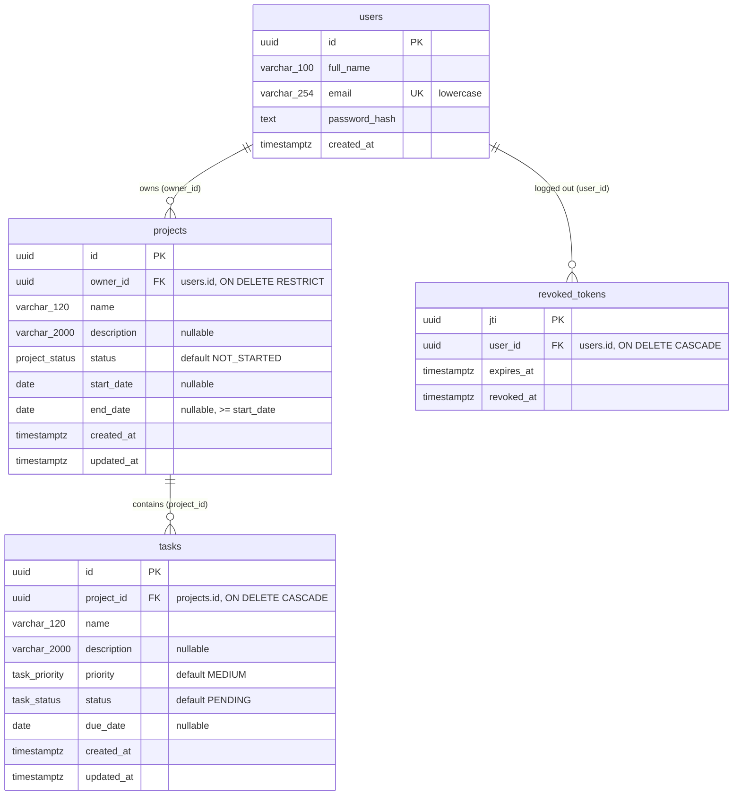

# Database Design

PostgreSQL schema design for the Project Management System. It implements the data model from [architecture.md](architecture.md) (section 6) under the decisions in [ADR-0003](decisions/0003-authentication-architecture.md), [ADR-0007](decisions/0007-database-access.md), [ADR-0011](decisions/0011-deployment-architecture.md) and [ADR-0013](decisions/0013-database-schema-design.md).

This is a design document. The Prisma schema and the first migration are written in Phase 5 from this design.

Target: Supabase PostgreSQL in production, a local Docker PostgreSQL for tests. The design uses only standard PostgreSQL features (no extensions, no Supabase-specific schemas), so both behave the same.

## 1. Overview

| Table | Purpose | Rows created by |
|---|---|---|
| `users` | Registered accounts | `POST /api/auth/register` |
| `projects` | Projects, each owned by one user | `POST /api/projects` |
| `tasks` | Tasks, each inside one project | `POST /api/tasks` |
| `revoked_tokens` | JWT ids (`jti`) of logged-out tokens that have not expired yet | `POST /api/auth/logout` |

Four tables, three enum types. There are no join tables, no derived/counter columns and no soft-delete columns.

## 2. Naming conventions

- Tables: lowercase, snake_case, plural (`users`, `projects`, `tasks`, `revoked_tokens`). Plural also avoids `user`, which is a reserved word in PostgreSQL.
- Columns: snake_case (`owner_id`, `created_at`).
- Enum types: snake_case (`project_status`, `task_status`, `task_priority`); values in uppercase as in the API (`NOT_STARTED`).
- Constraints and indexes: `<table>_<columns>_<suffix>` with suffixes `pkey`, `fkey`, `key` (unique), `idx`, `check`.
- The API and TypeScript code use camelCase; the mapping is defined in the Prisma schema (section 17).

## 3. Enum types

| Type | Values | Default |
|---|---|---|
| `project_status` | `NOT_STARTED`, `IN_PROGRESS`, `COMPLETED` | `NOT_STARTED` |
| `task_status` | `PENDING`, `IN_PROGRESS`, `COMPLETED` | `PENDING` |
| `task_priority` | `LOW`, `MEDIUM`, `HIGH` | `MEDIUM` |

Native PostgreSQL enums, as decided in ADR-0007:

- The database itself rejects any other value, independent of application validation.
- Each value is stored in 4 bytes and compared cheaply.
- Prisma maps them to TypeScript union types.

Values match `scope-and-decisions.md` section 6 exactly. The same lists exist as Zod enums in `packages/shared`; a test checks that both lists stay identical (ADR-0007). Adding a value later is a non-breaking `ALTER TYPE ... ADD VALUE`; removing or renaming one needs an expand/contract migration (section 18).

## 4. Entity definitions

All columns are `NOT NULL` unless marked nullable.

### 4.1 `users`

Registered accounts. Never returned whole by the API; `password_hash` is never selected into responses.

| Column | Type | Null | Default | Constraints / notes |
|---|---|---|---|---|
| `id` | `uuid` | no | `gen_random_uuid()` | Primary key `users_pkey` |
| `full_name` | `varchar(100)` | no | | `users_full_name_check`: `length(btrim(full_name)) > 0` |
| `email` | `varchar(254)` | no | | Unique `users_email_key`; `users_email_check`: `email = lower(email)` |
| `password_hash` | `text` | no | | bcrypt hash (60 characters for bcrypt); never the plaintext password |
| `created_at` | `timestamptz(3)` | no | `now()` | |

No `updated_at`: there is no feature that edits a user after registration. It can be added when such a feature exists.

### 4.2 `projects`

| Column | Type | Null | Default | Constraints / notes |
|---|---|---|---|---|
| `id` | `uuid` | no | `gen_random_uuid()` | Primary key `projects_pkey` |
| `owner_id` | `uuid` | no | | FK `projects_owner_id_fkey` -> `users.id`, `ON DELETE RESTRICT` |
| `name` | `varchar(120)` | no | | `projects_name_check`: `length(btrim(name)) > 0` |
| `description` | `varchar(2000)` | yes | | `NULL` when not provided |
| `status` | `project_status` | no | `'NOT_STARTED'` | Set by the user only (never derived from tasks) |
| `start_date` | `date` | yes | | Date-only (PD-03) |
| `end_date` | `date` | yes | | Date-only (PD-03) |
| `created_at` | `timestamptz(3)` | no | `now()` | |
| `updated_at` | `timestamptz(3)` | no | `now()` | Set on every update |

Table constraint `projects_dates_check`: `start_date IS NULL OR end_date IS NULL OR end_date >= start_date` (PD-04).

### 4.3 `tasks`

| Column | Type | Null | Default | Constraints / notes |
|---|---|---|---|---|
| `id` | `uuid` | no | `gen_random_uuid()` | Primary key `tasks_pkey` |
| `project_id` | `uuid` | no | | FK `tasks_project_id_fkey` -> `projects.id`, `ON DELETE CASCADE`; never changed after insert (PD-08) |
| `name` | `varchar(120)` | no | | `tasks_name_check`: `length(btrim(name)) > 0` |
| `description` | `varchar(2000)` | yes | | `NULL` when not provided |
| `priority` | `task_priority` | no | `'MEDIUM'` | |
| `status` | `task_status` | no | `'PENDING'` | |
| `due_date` | `date` | yes | | Date-only; not tied to the project's dates (PD-05) |
| `created_at` | `timestamptz(3)` | no | `now()` | |
| `updated_at` | `timestamptz(3)` | no | `now()` | Set on every update |

There is no `owner_id` column. The owner of a task is the owner of its project.

### 4.4 `revoked_tokens`

One row per logged-out token that has not expired yet (ADR-0003).

| Column | Type | Null | Default | Constraints / notes |
|---|---|---|---|---|
| `jti` | `uuid` | no | | Primary key `revoked_tokens_pkey`; the token's `jti` claim |
| `user_id` | `uuid` | no | | FK `revoked_tokens_user_id_fkey` -> `users.id`, `ON DELETE CASCADE` |
| `expires_at` | `timestamptz(3)` | no | | Copy of the token's `exp`; the row is useless after this time |
| `revoked_at` | `timestamptz(3)` | no | `now()` | When the logout happened |

`jti` is the natural primary key: it is a random UUID created for each issued token and already unique, so a separate surrogate id would add nothing. The primary key also makes a second logout with the same token a no-op (the insert conflicts and is ignored).

`revoked_at` is kept because it costs little and answers "when was this session ended" when diagnosing logout problems. It is not used by authentication logic.

## 5. Entity-relationship diagram



Ownership chain:

```
users (1) ---owns---> (N) projects (1) ---contains---> (N) tasks
```

## 6. Relationships and cardinality

| Relationship | Cardinality | Required | Foreign key |
|---|---|---|---|
| User owns Project | 1 to 0..N | Every project has exactly one owner | `projects.owner_id -> users.id` |
| Project contains Task | 1 to 0..N | Every task belongs to exactly one project | `tasks.project_id -> projects.id` |
| User has revoked tokens | 1 to 0..N | Every revoked token belongs to one user | `revoked_tokens.user_id -> users.id` |

A user can have no projects; a project can have no tasks. There is no sharing: a project has exactly one owner and a task exactly one project.

**Why ownership is not duplicated on tasks.** Authorization for a task follows `tasks.project_id -> projects.owner_id`. Storing `owner_id` on tasks as well would create a second source of truth that could disagree with the project (for example after a bug or a manual data fix), and every task query would still need to be correct about which one to trust. With one chain there is nothing to keep in sync, and the join it needs is cheap because both sides are indexed (section 9).

`revoked_tokens` is not part of the project/task data. It references `users` only so that each revocation belongs to an existing account and is removed with it.

## 7. Foreign keys and referential actions

| Foreign key | ON DELETE | ON UPDATE | Reason |
|---|---|---|---|
| `projects.owner_id -> users.id` | `RESTRICT` | `CASCADE` | Deleting users is not a feature. `RESTRICT` makes sure a user with projects can never be deleted by accident, which would silently remove all their data. |
| `tasks.project_id -> projects.id` | `CASCADE` | `CASCADE` | PD-09: deleting a project deletes its tasks. Enforced by the database, so no orphan task can exist even if application code changes. |
| `revoked_tokens.user_id -> users.id` | `CASCADE` | `CASCADE` | A revocation has no meaning without its user. |

`ON UPDATE CASCADE` is the ORM default and has no practical effect: primary keys are UUIDs that are never updated.

Orphan tasks are impossible: `tasks.project_id` is `NOT NULL` and has a foreign key, and a project cannot be deleted without its tasks being deleted in the same statement.

## 8. Constraints and validation layers

The API validates every request with the shared Zod schemas (architecture section 11). The database repeats the rules that protect data integrity, so invalid data cannot be stored even through a bug, a seed script or a manual change.

| Rule | Application (Zod) | Database |
|---|---|---|
| Email format, max 254 | yes | length only (`varchar(254)`) |
| Email lowercase, trimmed | yes (transform) | `users_email_check` (`email = lower(email)`) |
| Email unique | via the database error (409) | unique index `users_email_key` |
| Full name 1 to 100 characters, trimmed | yes | `varchar(100)` + non-blank check |
| Password 8 to 72 bytes | yes | not applicable: only the hash is stored |
| Project/task name 1 to 120 characters, trimmed | yes | `varchar(120)` + non-blank check |
| Description max 2000 characters | yes | `varchar(2000)` |
| Empty description stored as `NULL` | yes (empty or blank string becomes `null`) | no |
| Status / priority values | yes (Zod enum) | enum types |
| Dates are real calendar dates in `YYYY-MM-DD` | yes | `date` type rejects invalid dates |
| `end_date >= start_date` when both set | yes | `projects_dates_check` |
| Task due date inside project dates | not required (PD-05) | not required |
| Task belongs to the caller's project | yes (ownership-scoped query) | foreign key guarantees the project exists |
| `project_id` not changed on update | yes (not in the update schema) | not enforced (would need a trigger) |
| Unique `jti` | n/a | primary key |

Notes:
- `varchar(n)` limits characters, not bytes, which matches how the application counts.
- The password limit of 72 bytes exists because bcrypt only uses the first 72 bytes of its input; it is enforced before hashing and has no database counterpart.
- Trimming happens in the application. The database checks only that required names are not blank, because a check like `name = btrim(name)` would make the database responsible for formatting rather than integrity.
- `project_id` immutability is an application rule (ADR-0013 explains why there is no trigger).

## 9. Index strategy

Indexes are chosen from the queries the API actually runs. Per-user data volume is small (tens to hundreds of rows, scope document section 7), so the goal is a correct access path for each query, not covering every filter combination.

### 9.1 Indexes created

| Index | Columns | Used by | Why |
|---|---|---|---|
| `users_pkey` | `id` (primary key) | `GET /api/auth/me`, FK checks | Automatic |
| `users_email_key` | `email` (unique) | Login lookup, registration uniqueness | Enforces PD-15 uniqueness and makes login a single index lookup |
| `projects_pkey` | `id` (primary key) | Project by id, task -> project join | Automatic |
| `projects_owner_id_created_at_idx` | `owner_id, created_at` | Project list (newest first), project search/filter, dashboard project counts, ownership join from tasks | Every project query starts with `owner_id = $user`. The second column returns rows already in `created_at` order (read backwards for `DESC`). Also serves as the index for the foreign key. |
| `tasks_pkey` | `id` (primary key) | Task by id | Automatic |
| `tasks_project_id_created_at_idx` | `project_id, created_at` | Tasks of a project (newest first), all of a user's tasks (via the user's project ids), dashboard task counts, cascade delete | Needed for `ON DELETE CASCADE`: without an index on `project_id`, deleting a project scans the whole `tasks` table. |
| `revoked_tokens_pkey` | `jti` (primary key) | Revocation check on every authenticated request | One index lookup per request |

### 9.2 Indexes deliberately not created

| Candidate | Reason it is unnecessary |
|---|---|
| `projects (owner_id, status)` | The owner index narrows to one user's projects (a few rows); filtering those by status in memory is trivial. Can be added later if measurements show a need. |
| `tasks (project_id, status)`, `tasks (project_id, priority)` | Same reasoning: rows are already narrowed to one user's projects. |
| Index on `name` for search | Search is `ILIKE '%term%'` (partial match anywhere), which a normal B-tree index cannot use. A trigram index needs the `pg_trgm` extension and is only worthwhile for large tables. |
| Full-text search index | Not required; search is partial name matching (PD-12). |
| `revoked_tokens (expires_at)` | Only the cleanup step uses it, on a table that holds at most 7 days of logouts. A sequential scan is fine at this size. |
| `revoked_tokens (user_id)` | Only used when deleting a user, which is not a feature. |
| Separate single-column index on `projects.owner_id` or `tasks.project_id` | The composite indexes above start with these columns and already serve those lookups. |
| Indexes on `created_at` alone | Lists are always scoped by owner or project first. |

If real data grows, the first additions would be `(owner_id, status)` and `(project_id, status)`; both are additive and safe to introduce later (section 18).

## 10. Ownership and authorization in queries

The security invariant from architecture section 8: **every query that reads, changes or counts projects or tasks contains the authenticated user's id in its condition.** The id always comes from the verified token, never from the request body.

Conceptual queries (SQL for clarity; the API expresses the same conditions through Prisma):

| Operation | Condition |
|---|---|
| Project by id | `WHERE p.id = $id AND p.owner_id = $user` |
| Project list / search / filter | `WHERE p.owner_id = $user [AND p.name ILIKE $pattern] [AND p.status = $status] ORDER BY p.created_at DESC, p.id DESC` |
| Update project | `UPDATE projects SET ... WHERE id = $id AND owner_id = $user` (0 rows affected -> 404) |
| Delete project | `DELETE FROM projects WHERE id = $id AND owner_id = $user` (0 rows -> 404; tasks removed by cascade) |
| Task by id | `... FROM tasks t JOIN projects p ON p.id = t.project_id WHERE t.id = $id AND p.owner_id = $user` |
| Task list (all) | `... JOIN projects p ON p.id = t.project_id WHERE p.owner_id = $user [filters] ORDER BY t.created_at DESC, t.id DESC` |
| Task list for a project | first `SELECT 1 FROM projects WHERE id = $projectId AND owner_id = $user` (no row -> 404, PD-11), then `WHERE t.project_id = $projectId [filters]` |
| Create task | the target project must match `id = $projectId AND owner_id = $user` (no row -> 404) before the insert |
| Update / delete task | `WHERE t.id = $id AND t.project_id IN (SELECT id FROM projects WHERE owner_id = $user)` (0 rows -> 404) |

Properties of this structure:
- A row owned by someone else and a row that does not exist produce the same result (no match), so the API returns 404 for both without extra logic (PD-17).
- Updates and deletes apply the ownership condition in the same statement that changes data. There is no separate "check, then write" step that could be raced or forgotten.
- Search terms are passed as parameters. Characters with special meaning in `ILIKE` (`%`, `_`, `\`) are escaped by the application so that user input is matched literally.
- `ORDER BY created_at DESC, id DESC`: `id` breaks ties between rows created in the same millisecond so the order is stable between requests.

## 11. Dashboard queries

All counts for the authenticated user, computed on request (nothing stored):

| Statistic | Query (conceptual) |
|---|---|
| Total projects | `SELECT count(*) FROM projects WHERE owner_id = $user` |
| Projects in progress | `SELECT count(*) FROM projects WHERE owner_id = $user AND status = 'IN_PROGRESS'` |
| Total, completed, pending, in-progress tasks | `SELECT t.status, count(*) FROM tasks t JOIN projects p ON p.id = t.project_id WHERE p.owner_id = $user GROUP BY t.status` |

- One grouped query gives the count per task status; total tasks is their sum.
- "Pending tasks" is the count for status `PENDING` only (PD-01). `IN_PROGRESS` tasks are a separate count.
- Project status is the user's manual value; no query derives it from tasks.
- The two project counts can also be one query with `count(*) FILTER (WHERE status = 'IN_PROGRESS')`.
- Access paths: `projects_owner_id_created_at_idx` for the user's projects, `tasks_project_id_created_at_idx` for their tasks.

Counts are not stored in any table: storing them would duplicate data that has to be updated on every task change and could drift.

## 12. Search and filtering

| Resource | Search | Filters | Order |
|---|---|---|---|
| Projects | `name ILIKE '%' \|\| $term \|\| '%'` (case-insensitive, partial) | `status` | `created_at DESC, id DESC` |
| Tasks | same, on task name | `status`, `priority`, optional `projectId` | `created_at DESC, id DESC` |

- Filters combine with AND and are always added on top of the ownership condition.
- Search applies to `name` only (PD-12).
- No full-text search and no extension is needed.

## 13. Deletion behavior

```
DELETE project P (authorized: P.owner_id = current user)
  |
  +-- task 1  deleted by ON DELETE CASCADE
  +-- task 2  deleted by ON DELETE CASCADE
  +-- task 3  deleted by ON DELETE CASCADE
```

- The API runs one `DELETE` on `projects` with the ownership condition. PostgreSQL deletes the project's tasks in the same transaction.
- The clients ask for confirmation before sending the request (PD-09); the database does not know about confirmation.
- Deleting a task deletes only that row.
- No soft delete: there are no `deleted_at` columns, and deleted rows are gone. Nothing in the requirements needs restore or history.

## 14. Revoked token design

Follows ADR-0003: JWT with a unique `jti` per issued token, 7-day lifetime, no refresh tokens.

| Step | Database operation |
|---|---|
| Login / register | Nothing is stored. The token carries `sub`, `jti`, `iat`, `exp`. |
| Authenticated request | `SELECT 1 FROM revoked_tokens WHERE jti = $jti` (primary key lookup). Found -> 401. |
| Logout | `INSERT INTO revoked_tokens (jti, user_id, expires_at) VALUES (...) ON CONFLICT (jti) DO NOTHING` |
| Cleanup | `DELETE FROM revoked_tokens WHERE expires_at < now()` |

- **Independent sessions:** web and mobile logins receive different `jti` values. Logging out on one platform inserts only that platform's `jti`, so the other token keeps working (PD-18).
- **Expiration:** a token past `exp` is rejected by signature verification before the table is consulted, so rows whose `expires_at` has passed can be deleted safely.
- **Size:** the table never holds more than 7 days of logouts.
- **Cleanup:** the cleanup statement above was planned to run on API startup and on an interval. It was deferred in Phase 5 and is not implemented ([backend-design.md](backend-design.md), section 16). Expired rows are harmless.
- **No token values stored:** only the `jti`, never the JWT itself.

## 15. Timestamps and dates

| Kind | Columns | Type | Behavior |
|---|---|---|---|
| Event time | `created_at`, `updated_at`, `revoked_at`, `expires_at` | `timestamptz(3)` | Stored as an absolute point in time (UTC internally). Millisecond precision matches JavaScript `Date`. Returned by the API as ISO 8601 UTC strings. |
| Business date | `start_date`, `end_date`, `due_date` | `date` | Calendar date with no time or timezone (PD-03). Sent and returned as `YYYY-MM-DD`. |

- `created_at` defaults to `now()` in the database.
- `updated_at` exists on `projects` and `tasks` because they are edited (`PUT`). It records the last change, which helps when checking cross-platform sync (last write wins, architecture section 19). It is set by the ORM on every update and defaults to `now()` on insert. It is not part of the required API fields; whether responses include it is decided in Phase 4.
- `users` and `revoked_tokens` have no `updated_at`: their rows are never updated.
- The database session time zone is left at UTC (the default on Supabase and on the official Docker image). `timestamptz` values are correct regardless, but this keeps manual SQL output easy to read.
- Date-only values must never pass through a local-time `Date` conversion in the application; the API converts them as UTC midnight and formats them back to `YYYY-MM-DD` (ADR-0007).

## 16. Normalization

The schema is in third normal form (and BCNF):

- Every column holds a single value (no lists, no repeating groups such as `task1`, `task2`).
- Every non-key column depends only on its table's primary key: project data on the project id, task data on the task id.
- No transitive dependencies: tasks do not store their owner or project name; both are reached through `project_id`.

Deliberately not stored:
- dashboard counts (computed per request, section 11)
- project status derived from tasks (status is manual)
- owner on tasks (derived through the project)
- copies of user data in projects or tasks

## 17. Prisma mapping plan

The Prisma schema is written in Phase 5. This section fixes the intended mapping; exact syntax is checked against the pinned Prisma 6 version at that time. ADR-0007's pending validation (exact Prisma 6 version and the pg adapter with Supabase's transaction-mode pooler) is not affected by this design and remained open at that time; it was closed in Phases 5 and 8, and ADR-0007 is accepted.

| Database | Prisma |
|---|---|
| `users` | `model User` with `@@map("users")` |
| `projects` | `model Project` with `@@map("projects")` |
| `tasks` | `model Task` with `@@map("tasks")` |
| `revoked_tokens` | `model RevokedToken` with `@@map("revoked_tokens")` |
| `project_status`, `task_status`, `task_priority` | `enum ProjectStatus`, `enum TaskStatus`, `enum TaskPriority`, each mapped to the snake_case type name |
| snake_case columns | camelCase fields with `@map` (for example `ownerId @map("owner_id")`) |
| `uuid` primary keys with `gen_random_uuid()` | `String @id @default(dbgenerated("gen_random_uuid()")) @db.Uuid` |
| `jti` primary key | `jti String @id @db.Uuid` (no default; the API supplies it) |
| `varchar(n)` | `String @db.VarChar(n)` |
| `date` | `DateTime @db.Date` |
| `timestamptz(3)` | `DateTime @db.Timestamptz(3)` (`@default(now())`; `updatedAt` also `@updatedAt`) |

Relations:

| Relation | Fields |
|---|---|
| User - Project | `User.projects Project[]`; `Project.owner User @relation(fields: [ownerId], references: [id], onDelete: Restrict)` |
| Project - Task | `Project.tasks Task[]`; `Task.project Project @relation(fields: [projectId], references: [id], onDelete: Cascade)` |
| User - RevokedToken | `User.revokedTokens RevokedToken[]`; `RevokedToken.user User @relation(fields: [userId], references: [id], onDelete: Cascade)` |

Indexes and unique constraints:
- `User.email` with `@unique` (`users_email_key`)
- `Project`: `@@index([ownerId, createdAt])`
- `Task`: `@@index([projectId, createdAt])`

Not expressible in the Prisma schema, added as SQL in the migration:
- `users_email_check`, `users_full_name_check`, `projects_name_check`, `tasks_name_check`, `projects_dates_check`

The first migration is created with Prisma's create-only option, the `CHECK` constraints are appended to its SQL, and the result is reviewed before it is applied. Phase 5 confirmed that Prisma leaves these constraints untouched: generating a new migration after applying the first one produced an empty migration.

## 18. Migration strategy

Consistent with ADR-0011.

**Creating migrations (development only)**
- Migrations are generated against the local Docker PostgreSQL, never against Supabase. Prisma's development migration command also uses a temporary shadow database, which must be local.
- Each migration is a folder of SQL in `apps/api/prisma/migrations/`, committed to the repository and reviewed like code.
- Applied migrations are never edited; corrections are new migrations.

**Test database**
- The Docker test database is brought to the latest schema with `prisma migrate deploy` before the test run; tables are truncated between test files.

**Production (Supabase), controlled and manual**
1. `prisma migrate status` with `DIRECT_URL`: confirm which migrations are pending.
2. `prisma migrate deploy` with `DIRECT_URL`.
3. `prisma migrate status` again: confirm the schema is up to date; check the expected tables, columns and constraints in Supabase.
4. Only then deploy the API (ADR-0011 sequence).

- `DIRECT_URL` lives only on the machine that runs migrations, in a git-ignored file. It is not configured on Render; the API uses `DATABASE_URL` (pooler) at runtime.
- Migrations never run from the Render build or at server start.

**Backward compatibility (expand/contract)**

The database is migrated before the new API version is deployed, so each migration must work with the API version that is still running:

| Change | Safe approach |
|---|---|
| Add a nullable column or a new table | One migration; old code ignores it |
| Add a `NOT NULL` column | Add with a default (or nullable), backfill, then tighten in a later migration |
| Add an index | One migration (additive) |
| Add an enum value | One migration (additive) |
| Rename or remove a column, enum value or table | Expand: add the new form and deploy code that uses it. Contract: remove the old form in a later migration after no running code uses it |

The initial migration creates all four tables, three enum types, indexes and checks in one step, since no API is running yet.

## 19. Requirement coverage

| Requirement | Supported by |
|---|---|
| AUTH-01, AUTH-02, AUTH-03 | `users`; `users_email_key`; `users_email_check`; `password_hash` only |
| AUTH-04, AUTH-06 | `users_email_key` lookup; `users_pkey` lookup |
| AUTH-05, AUTH-07, PD-18 | `revoked_tokens` keyed by `jti`; `expires_at` |
| AUTH-08, SYNC-01 | One database for both clients; no client-specific tables |
| PROJ-01 to PROJ-06 | `projects`; enum `project_status`; `projects_dates_check`; length limits |
| PROJ-05, PD-09, DB-03 | `tasks.project_id` `ON DELETE CASCADE` |
| TASK-01 to TASK-08 | `tasks`; enums `task_status`, `task_priority`; FK to `projects` |
| DASH-01, DASH-02, PD-01 | Ownership-scoped counts (section 11) |
| SRCH-01 to SRCH-05 | Ownership-scoped `ILIKE` search and enum filters (section 12) |
| SEC-02, PD-17 | Ownership chain users -> projects -> tasks; scoped conditions (section 10) |
| DB-01 to DB-05 | Sections 4 to 9 and 18 |
